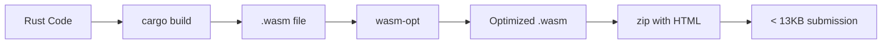

# JS13K Space Invaders - Rust/WASM Edition 🎮

A minimal Space Invaders clone for [js13kGames](https://js13kgames.com/) competition, written in Rust and compiled to WebAssembly.

**Current size: 3,903 bytes** (zipped) - only 29% of the 13KB limit! 🎯

## 🎯 WarsawJS Meetup #129

This project is a demo for the WarsawJS talk:
- **Date:** 2025-08-13
- **Speaker:** dr Piotr Migdał
- **Title:** "Thanks to AI, you can WASM. Yes, even in Rust!"

> AI is reshaping frontend development. It's no longer just about simplifying tedious tasks; it's about unlocking new superpowers. With a few well-crafted prompts, you can use WebAssembly and Rust with ease—no prior experience required. Your next WASM-powered 3D data visualization, award-winning hackathon game, or interactive zen simulation is now just a few prompts away!

## 🚀 Quick Start

### Prerequisites
```bash
# Install Rust with WASM target
rustup target add wasm32-unknown-unknown

# (Optional) Install wasm-opt for additional optimization
npm install -g wasm-opt
```

### Build & Run
```bash
# Install dependencies
pnpm install

# Build the game
pnpm build

# Check submission size
pnpm size

# Play the game
pnpm serve
# Open http://localhost:3000
```

## 🎮 Game Controls

- **←/→** Arrow Keys: Move spaceship
- **Space**: Fire bullets

## 🏗️ Architecture Decisions for JS13K

### Why Rust + WASM?
- **Predictable size**: Rust's zero-cost abstractions and no runtime overhead
- **No JavaScript framework**: All game logic in WASM, minimal JS glue code
- **Performance**: 60 FPS rendering with direct pixel manipulation

### Size Optimization Techniques

#### 1. **Minimal Dependencies**
```toml
[dependencies]
wee_alloc = "0.4"  # Tiny allocator (1KB vs 10KB default)
```

#### 2. **Aggressive Compiler Optimization**
```toml
[profile.release]
opt-level = "z"     # Optimize for size
lto = true          # Link-time optimization
codegen-units = 1   # Single codegen unit
panic = "abort"     # No unwinding code
strip = true        # Strip symbols
```

#### 3. **No Standard Library**
```rust
#![no_std]
extern crate alloc;  # Only use alloc, not full std
```

#### 4. **Minimal JavaScript**
- No frameworks, no bundlers
- Inline JS in HTML (~400 bytes)
- Direct WASM instantiation

#### 5. **Efficient Rendering**
- Single pixel buffer in WASM
- Direct memory access from JS
- No JSON serialization

### File Structure
```
├── src/lib.rs      # Complete game logic (Rust)
├── index.html      # Minimal HTML + inline JS
├── Cargo.toml      # Rust config with size optimizations
└── package.json    # Build scripts
```

## 📊 Size Breakdown

| Component | Size (gzipped) |
|-----------|---------------|
| WASM binary | ~3.5 KB |
| HTML + JS | ~0.4 KB |
| **Total** | **3.9 KB** |

## 🔧 Development Tips

### Testing Size Impact
Before adding any feature:
```bash
pnpm size  # Check current size
# ... make changes ...
pnpm size  # Compare new size
```

### Further Optimization Ideas
1. **Replace wee_alloc**: Write custom allocator (~200 bytes saving)
2. **Simplify graphics**: Use 1-bit colors instead of RGB
3. **Compress assets**: Pack sprites into bit arrays
4. **Minify WASM**: Use `wasm-opt -Oz` for maximum compression

### Common Pitfalls
- ❌ Don't use `format!()` or `println!()` - adds 10KB+
- ❌ Avoid HashMap/HashSet - use arrays
- ❌ No external crates unless absolutely necessary
- ✅ Use arrays over Vec when size is known
- ✅ Prefer bitwise operations over complex math

## 🛠️ Build Pipeline



## 📚 Resources

- [js13kGames Competition](https://js13kgames.com/)
- [WebAssembly](https://webassembly.org/)
- [Rust WASM Book](https://rustwasm.github.io/book/)
- [wee_alloc](https://github.com/rustwasm/wee_alloc)

## 🤖 AI-Powered Development

This project demonstrates how AI assistants can help you:
1. Write Rust code without prior experience
2. Understand WASM compilation and optimization
3. Debug size and performance issues
4. Apply js13k-specific optimizations

**Pro tip:** When prompting AI for js13k games, always mention:
- The 13KB size limit
- Need for minimal dependencies
- Preference for inline code over external files
- Requirement for aggressive size optimization

## 📝 License

Public Domain (Unlicense) - Use freely for any purpose, including your own js13k entry!

---

*Created for WarsawJS Meetup #129 - Demonstrating AI-assisted WASM development*